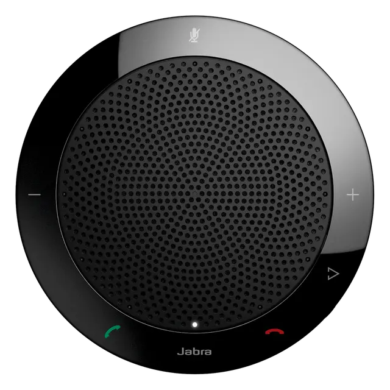

# Jabra Speak 410



Peripheral controller for the [Jabra Speak 410](https://www.jabra.com/business/speakerphones/jabra-speak-series/jabra-speak-410) USB speakerphone, running alongside the Linux Voice Assistant (LVA) container.

The controller connects to the Jabra Speak 410 via USB HID, drives its LED ring to reflect the current assistant state, and maps its hardware buttons to LVA commands. It also optionally integrates with PipeWire for volume control and hardware mute detection.

**Credit:** This integration was written by [@machineonamission](https://github.com/machineonamission). Source repository: [machineonamission/lva-jabra-speak-410](https://github.com/machineonamission/lva-jabra-speak-410).

> **This board connects over USB** — no GPIO, no SPI, no HAT required. It works on any Linux host.

[Demo Video](./demo.mp4)

---

## Hardware

| Component | Details |
|---|---|
| Connection | USB (Vendor `0x0b0e`) |
| Microphone | 360° omni, enumerates as USB audio |
| Speaker | Built-in 360° speaker |
| LED ring | Integrated ring (state-driven via USB HID) |
| Buttons | Call / hang-up, mute, volume up, volume down |

---

## LED states

The Jabra Speak 410 has an internal telephony state machine that maps LED patterns to button behaviour. The controller uses this to mirror the assistant state:

| LVA state | LED pattern | Description |
|---|---|---|
| Idle | Off | Default state |
| Wake word detected | Flashing | Ring flashes |
| Listening | 3 green | Ring solid green |
| Thinking | Flashing | Ring flashes |
| TTS speaking | Partial flash | Ring partially flashing |
| TTS finished | Off | Returns to default |
| Muted | All red | Entire ring solid red |
| Pipeline error | Red flash (×4) | Ring rapidly flashes red then returns to off |
| Timer ringing | Flashing | Ring flashes |
| No HA connection | Flashing | Ring flashes |

> **Note:** The Jabra Speak 410 is a telephony device with a fixed firmware state machine. The LED patterns are constrained by its HID protocol — custom per-pixel colours are not possible.

---

## Button behaviour

### Call button
Context action — starts listening when idle; dismissed by hang-up gesture during active pipeline.

### Hang-up / flash button
| Current state | Command sent |
|---|---|
| Timer ringing | `stop_timer_ringing` |
| Wake word / listening / thinking / TTS speaking | `stop_pipeline` |
| Music / media playing | `stop_media_player` |

### Volume Up/Down buttons
Controlled by `VOLUME_CONTROL` setting (see configuration). The controller can either adjust the PipeWire sink volume directly, or send `volume_up` / `volume_down` commands to LVA.

### Mute button
Togges microphone mute. Sends `mute_mic` when unmuted, `unmute_mic` when muted.

> **Mute button caveat:** The Jabra Speak 410 does not expose the mute button state over HID when not in an active call. The controller detects mute by reading the raw audio stream from PipeWire — all-zero audio indicates hardware mute has engaged. This requires PipeWire to be exposed to the container (see installation).

---

## Installation

### Step 1 — Add udev rule

Run once on the **host**:

```bash
sudo tee /etc/udev/rules.d/99-jabra.rules << 'EOF'
SUBSYSTEM=="usb", ATTR{idVendor}=="0b0e", MODE="0666", GROUP="plugdev"
EOF
sudo udevadm control --reload-rules
sudo udevadm trigger
```

Verify the device is visible:

```bash
lsusb | grep 0b0e
# Example: Bus 001 Device 007: ID 0b0e:0412 GN Netcom ...
```

### Step 2 — Expose PipeWire to the container

The mute button detection requires PipeWire. Follow the [LVA audio server documentation](https://github.com/OHF-Voice/linux-voice-assistant/blob/main/docs/install_audioserver.md) to expose the PipeWire socket.

Find your runtime directory:

```bash
echo $XDG_RUNTIME_DIR
# Typically: /run/user/1000
```

Update the volume mounts in `docker-compose.yml` if your path is different from `/run/user/1000`.

### Step 3 — Configure LVA to use the Jabra microphone

The Jabra Speak 410 enumerates as a standard USB audio device. Pass the device to LVA:

```bash
--audio-input-device "Jabra SPEAK 410"
```

Or in LVA's compose environment:

```yaml
environment:
  - AUDIO_INPUT_DEVICE=Jabra SPEAK 410
```

### Step 4 — File structure

```
Jabra Speak 410/
├── docker-compose.yml
└── (no build required — uses pre-built image)
```

### Step 5 — Start

```bash
cd jabra_speak_410
```

#### Option A — Run with Docker Compose (recommended)

```bash
docker compose up -d
```

Check logs:

```bash
docker compose logs -f
```

#### Option B — Run directly with Python

```bash
pip install hidapi websocket-client pycaw pycaw[pipewire]
export LVA_WS_URL=ws://localhost:6055
export XDG_RUNTIME_DIR=/run/user/1000
export PULSE_SERVER=unix:/run/user/1000/pulse/native
python main.py
```

---

## Configuration

All options are set via environment variables in `docker-compose.yml`:

| Variable | Default | Description |
|---|---|---|
| `LVA_WS_URL` | `ws://localhost:6055` | LVA peripheral API WebSocket URL |
| `XDG_RUNTIME_DIR` | `/run/user/1000` | PipeWire runtime directory (must match volume mount) |
| `PULSE_SERVER` | `unix:/run/user/1000/pulse/native` | PulseAudio / PipeWire-Pulse socket path |
| `PW_SINK` | `@DEFAULT_SINK@` | PipeWire sink for volume control |
| `VOLUME_CONTROL` | *(unset)* | Volume button mode — see below |

### Volume control modes

| Value | Behaviour |
|---|---|
| `pipewire` | Adjusts PipeWire sink volume directly via `wpctl` on each button press |
| `lva` | Sends `volume_up` / `volume_down` commands to LVA |
| *(unset)* | Volume button presses are ignored |

> **Warning:** Do not use `VOLUME_CONTROL=lva` if your host OS is also processing HID volume events from the Jabra — this will result in double volume changes.

---

## Drivers summary

| Component | Driver needed | How |
|---|---|---|
| Jabra HID (LEDs + buttons) | udev rule | `99-jabra.rules` on host |
| Microphone (USB audio) | **None** | Enumerates as USB audio device automatically |
| Mute detection | PipeWire socket | Expose `$XDG_RUNTIME_DIR` to container |

---

## Known limitations

**Mute button detection** requires PipeWire to be exposed to the container. Without it, the mute button will not work. This is a firmware limitation of the Jabra Speak 410 — the device does not report the mute button state over HID unless it believes it is in an active call.

**Volume button exclusivity** — `hidapi` takes full ownership of the USB HID interface. External tools that rely on HID volume events (such as `alsa_volume_from_usb_hid`) will not function while this container is running.

**LED pattern constraints** — The Jabra Speak 410 firmware enforces a telephony state machine. LED patterns are limited to what the device's HID protocol supports; custom animations or per-pixel colour control are not possible.

---

## Troubleshooting

### Device not found at startup

1. Confirm `lsusb | grep 0b0e` shows the device.
2. Check the udev rule is applied: `ls -la /dev/bus/usb/<bus>/<device>` should show group `plugdev` with mode `0666`.
3. Restart the container after plugging in the device.

### Mute button has no effect

1. Confirm the PipeWire socket volume mount is correct and the path exists on the host: `ls $XDG_RUNTIME_DIR/pipewire-0`.
2. Run with debug logging and look for `pw-record not found` — this means `wireplumber` is not installed in the container. The pre-built image includes it.
3. Check that `XDG_RUNTIME_DIR` in the container environment matches the volume mount path.

### Double volume changes

Set `VOLUME_CONTROL` to `pipewire` instead of `lva`, or leave it unset. The `lva` mode conflicts with OS-level HID volume processing.

### LVA not reachable

1. Confirm LVA is running and port 6055 is open: `nc -zv localhost 6055`.
2. With `network_mode: host`, `localhost` resolves to the host itself.
3. If LVA is on a different machine, change `LVA_WS_URL` to its IP address.
