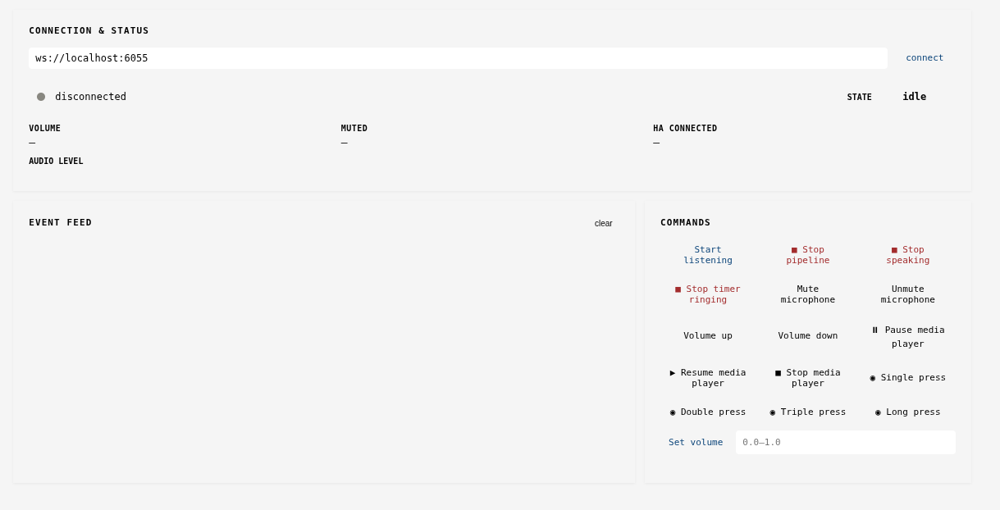
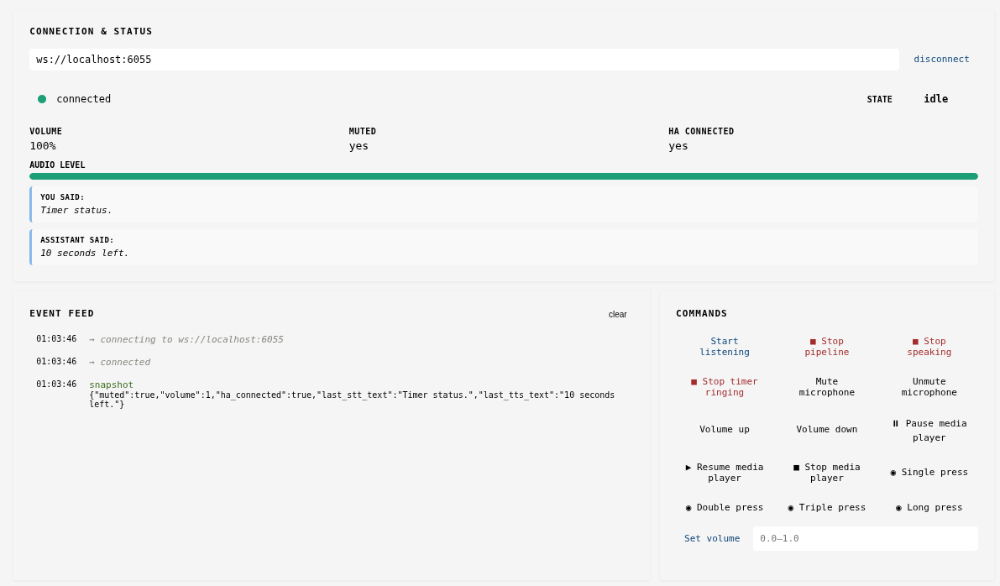

# Peripheral Web Console

The Peripheral Web Console is a web-based interface for testing and interacting with the Linux Voice Assistant WebSocket API. It allows you to monitor LVA state and send commands to control the voice assistant from a browser.

## Overview

This HTML console provides:
- Real-time connection status to the LVA WebSocket server
- Live event feed showing all LVA events (wake word detected, listening, TTS, timers, etc.)
- Control buttons to send commands to LVA (mute/unmute, volume control, start listening, etc.)
- Visual indicators for volume, mute state, and Home Assistant connection status
- Audio level visualization

## Getting Started

### Step 1: Download the HTML File

Download [peripheral_web_console.html](peripheral_web_console.html)


### Step 2: Open the HTML File in Your Browser

Open the file using any modern web browser (Chrome, Firefox, Safari, Edge):



**Option A: Direct File Open**
- Double-click the `peripheral_web_console.html` file
- Or drag it into your browser window
- The file will open as a local file URL (e.g., `file:///path/to/peripheral_web_console.html`)

**Option B: Using a Local Web Server**
```bash
# Using Python 3
python -m http.server 8000

# Using Python 2
python -m SimpleHTTPServer 8000

# Then navigate to: http://localhost:8000/peripheral_web_console.html
```

### Step 3: Configure the WebSocket Connection URL

When the page loads, you'll see the **CONNECTION & STATUS** section at the top with:
- Current WebSocket URL (default: `ws://localhost:6055`)
- A "connect" button

**To modify the connection URL:**
1. Look at the input field showing the WebSocket address
2. By default, it points to `ws://localhost:6055`
3. Change this if your LVA server is running on a different host or port:
   - Local development: `ws://localhost:6055`
   - Remote server: `ws://your-server-ip:6055`
   - Docker container: `ws://lva-container:6055` (if using Docker networking)

### Step 4: Connect to LVA



1. Once you've configured the URL, click the **"connect"** button
2. The page will attempt to establish a WebSocket connection to the LVA server
3. On successful connection:
   - The status indicator changes from "disconnected" (gray dot) to "connected" (green dot)
   - You'll receive a "snapshot" event showing the current state (volume, mute status, last recognized text, etc.)
   - Event feed will show: `connecting to ws://...`, `connected`, `snapshot`

4. If connection fails:
   - Ensure LVA is running and the WebSocket server is active
   - Verify the URL is correct (check host and port)
   - Check browser console (F12 → Console tab) for error messages
   - Verify network connectivity and firewall rules

## Using the Web Console

### Connection & Status Section

Displays real-time information:
- **Status Indicator**: Gray (disconnected) or Green (connected)
- **WebSocket URL**: The connection endpoint
- **STATE**: Current LVA state (idle, listening, thinking, etc.)
- **VOLUME**: Current volume level (0-100%)
- **MUTED**: Microphone mute status (yes/no)
- **HA CONNECTED**: Home Assistant connection status
- **AUDIO LEVEL**: Visual bar showing real-time audio input level

### Event Feed

Shows a chronological log of all events received from LVA:

**Example events:**
- `connecting to ws://localhost:6055`
- `connected`
- `snapshot` - Initial state when connected
- `wake_word_detected` - Wake word detected
- `listening` - Microphone is recording
- `stt_text: "set a timer for 10 seconds"` - Recognized speech
- `thinking` - Processing the command
- `tts_text: "OK, timer set."` - Assistant's response
- `tts_speaking` - Playing the response audio
- `idle` - Returned to waiting state
- `timer_ticking`, `timer_ringing` - Timer events
- `volume_changed`, `volume_muted` - Volume events
- `disconnected` - Connection lost

Click "clear" to remove all events from the feed.

### Commands Section

Send commands to LVA by clicking buttons:

**Listening & Pipeline:**
- **Start listening** - Manually trigger listening (as if wake word was detected)
- **Stop pipeline** - Abort the current voice pipeline (stops listening, thinking, speaking)

**Audio Control:**
- **Volume up** / **Volume down** - Adjust volume by small increments
- **Set volume** - Set exact volume level using slider (0.0-1.0)
- **Mute microphone** / **Unmute microphone** - Toggle microphone mute

**Media & Timers:**
- **Pause media player** / **Resume media player** / **Stop media player** - Control music playback
- **Stop timer ringing** - Silence an active timer alarm

**Button Presses:**
- **Single press**, **Double press**, **Triple press**, **Long press** - Simulate physical button inputs
- Useful for testing button-based interactions if LVA is connected to hardware buttons

## Example Workflow

1. **Start LVA server** with WebSocket peripheral API enabled
2. **Open** `peripheral_web_console.html` in browser
3. **Click "connect"** to establish WebSocket connection
4. **Observe events** as you interact with LVA via voice (e.g., "Hey Home Assistant, what time is it?")
5. **Send commands** from the console (e.g., click "Mute microphone" to test mute functionality)
6. **Watch feedback** in the event feed and status indicators

## Troubleshooting

### Connection Won't Establish
- **Problem**: "disconnected" status persists
- **Solutions**:
  - Verify LVA is running: `docker ps` (if using Docker) or check if the service started
  - Check the WebSocket URL is correct
  - Ensure firewall allows traffic on port 6055
  - Check browser console (F12) for detailed error messages

### No Events Appearing
- **Problem**: Connected but no events in feed
- **Solutions**:
  - Trigger an event manually (speak a wake word, click a button)
  - Check that the LVA peripheral API server is properly initialized
  - Verify the WebSocket connection is truly active (status should show "connected")

### Volume/State Not Updating
- **Problem**: Controls don't seem to work
- **Solutions**:
  - Confirm "connected" status is shown
  - Check that LVA is not muted at the system level
  - Try stopping and reconnecting
  - Check LVA logs for errors

### CORS or Mixed Content Errors
- **Problem**: Console shows security errors
- **Solutions**:
  - Use `http://` with `ws://` (not `https://` with `wss://`)
  - Serve the HTML over HTTP if testing locally
  - Ensure your LVA server is configured for WebSocket connections

## Protocol Details

The console communicates with LVA using JSON over WebSocket:

**Messages from LVA (Events):**
```json
{"event": "event_name", "data": {...}}
```

**Messages to LVA (Commands):**
```json
{"command": "command_name", "data": {...}}
```

**Initial Snapshot (on connect):**
```json
{
  "event": "snapshot",
  "data": {
    "muted": false,
    "volume": 1.0,
    "ha_connected": true,
    "last_stt_text": "...",
    "last_tts_text": "..."
  }
}
```

For detailed protocol documentation, see `peripheral_api.py` in the Linux Voice Assistant repository.

## Advanced Usage

### Accessing Remotely
To access the console from another computer:

1. **Expose LVA server** to your network (modify firewall/port forwarding)
2. **Open console** from remote machine
3. **Update WebSocket URL** to your LVA server's network address:
   ```
   ws://your-lva-server-ip:6055
   ```

### Integration with Peripherals
This console mirrors the interface used by physical peripherals (LED boards, buttons, etc.):
- Hardware peripherals use the same WebSocket API
- Testing here helps debug peripheral integrations
- Both console and hardware can be connected simultaneously

### Development & Debugging
Use browser Developer Tools (F12) to:
- Monitor WebSocket messages in Network tab
- Check console for JavaScript errors
- Inspect HTML structure and styling
- Test custom commands before deploying to hardware
