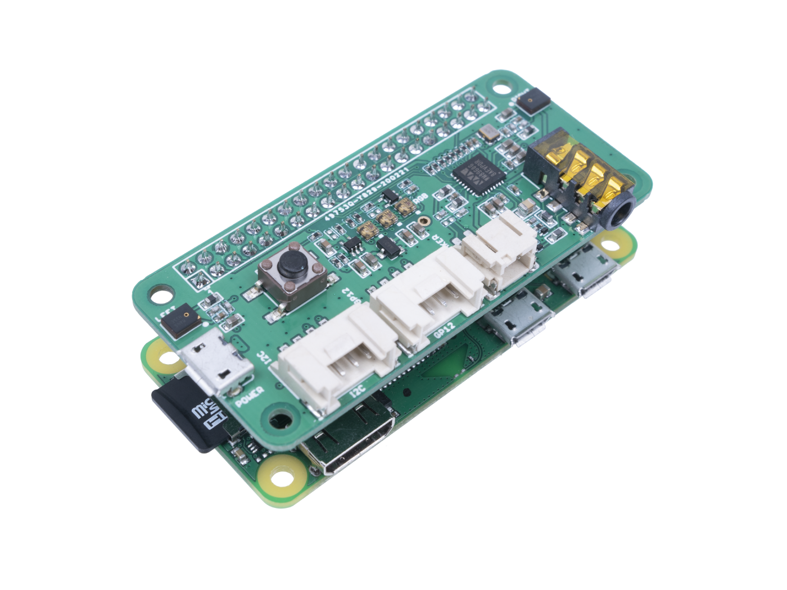

# ReSpeaker 2-Mic Pi HAT



Peripheral controller for the [ReSpeaker 2-Mic Pi HAT](https://wiki.seeedstudio.com/ReSpeaker_2_Mics_Pi_HAT/) by Seeed Studio, running alongside the Linux Voice Assistant (LVA) container.

The controller runs as a separate Docker container on the same Raspberry Pi. It connects to LVA's peripheral WebSocket API, drives the 3 APA102 RGB LEDs, and maps the single onboard button to context-aware LVA commands with multipress support.

---

## Hardware

| Component | Details |
|---|---|
| Microphone array | 2 × MEMS mics — MIC_L (left), MIC_R (right) — WM8960 codec, I2S |
| LED strip | 3 × APA102 RGB LEDs in a row |
| Speaker output | JST 2.0 connector + 3.5 mm audio jack (WM8960 codec) |
| Button | 1 × onboard tactile button (GPIO 17) |
| Interface | Raspberry Pi 40-pin HAT connector |

### Compatible hardware

| Board | Notes |
|---|---|
| Raspberry Pi Zero 2 W | Recommended for compact builds |
| Raspberry Pi 3 B / B+ | Fully supported |
| Raspberry Pi 4 B | Fully supported |
| Raspberry Pi 5 | Requires seeed-voicecard driver compatible with kernel 6.6+ — see Step 1 |

---

## GPIO pin mapping

### LED strip (APA102)

| Signal | GPIO (BCM) | Notes |
|---|---|---|
| MOSI (data) | GPIO 10 | SPI0 MOSI |
| SCLK (clock) | GPIO 11 | SPI0 SCLK |
| CE | GPIO 8 (CE0) | /dev/spidev0.0 |

### Button

| Function | GPIO (BCM) | Notes |
|---|---|---|
| Context action | GPIO 17 | Active low, internal pull-up enabled |

---

## LED positions

```
  ┌──────────────────────────────────────┐
  │  [LED 0]    [LED 1]    [LED 2]       │
  │  MIC_L      centre     MIC_R         │
  └──────────────────────────────────────┘
```

LED 0 sits above MIC_L and LED 2 sits above MIC_R. When the microphone is muted, these two LEDs turn red to visually indicate the mic positions are disabled. The centre LED (1) is used for general status animations.

---

## LED animations

| LVA state | Animation | LEDs |
|---|---|---|
| Not ready / no HA connection | Dim red pulse | All 3 |
| Idle | Off | All 3 off |
| Wake word detected | Flash (×2) in user color | All 3 |
| Listening | Chase (bouncing left ↔ right) in user color | 1 at a time |
| Thinking | Yellow pulse | All 3 |
| TTS speaking | Green breathe (slow sine) | All 3 |
| **Muted** | **Solid red** | **LEDs 0 & 2 only (mic positions)** |
| Error | Red flash (×3), then off | All 3 |
| **Timer ringing** | **Blue flash (repeating)** | **All 3** |
| Timer ticking | Dim cyan, brightness ∝ time left | All 3 |
| Media playing | Dim green steady | All 3 |

"User color" comes from the Home Assistant Light entity described below (default: HAVPE-style blue). HA brightness scales every animation in this table. Semantic colors (Thinking yellow, Speaking green, Muted red, Timer cyan/blue) are hardcoded so they remain recognisable across user customisation.

---

## Home Assistant Light entity

On connect the controller registers a Light entity with LVA, which appears in Home Assistant as `light.<satellite>_leds`. From the device page you can toggle the LEDs, change their RGB color, adjust brightness, and pick an effect.

### Effects

| Effect | Behaviour |
|---|---|
| `Voice Assistant` (default) | Run the pipeline animations from the table above. Wake word and Listening are tinted with the HA color; brightness scales every animation. |
| `Loop` | All three LEDs share the same hue and cycle through the HSV color wheel in unison. Five-second period. |
| `None` | Pipeline animations are suppressed. The LEDs hold the user-set solid color at the user-set brightness. Useful as a static accent or notification surface for HA automations. |

### Brightness, on/off, and color

Turning the Light off in HA puts the LEDs dark immediately and stops every animation; turning it back on resumes whatever matches the current LVA state. Brightness scales linearly across all effects and animations. RGB color drives the Wake word / Listening tint when effect is `Voice Assistant`, and is the solid color when effect is `None`. The Loop effect ignores the user color (it spans the whole wheel by design) but still respects on/off and brightness.

---

## Button behaviour

The single onboard button supports both single-press context actions and multi-press gestures:

### Single press (< 1000 ms hold time)

Context-aware command based on current state, mirroring the Home Assistant Voice PE centre button priority:

| Current state | Command sent |
|---|---|
| Timer ringing | `stop_timer_ringing` |
| Wake word / listening / thinking / TTS speaking | `stop_pipeline` |
| Music / media playing | `stop_media_player` |
| Any other, currently unmuted | `mute_mic` |
| Any other, currently muted | `unmute_mic` |

Idle single press toggles mic mute (matching HA Voice PE's centre button default). To start a conversation, use the wake word ("Hey Jarvis" by default).

### Multi-press gestures

Detected via press timing within a detection window (500 ms between releases):

| Gesture | Timing | Command sent |
|---|---|---|
| **Double press** | 2 presses < 500 ms apart | `button_double_press` |
| **Triple press** | 3 presses < 500 ms apart | `button_triple_press` |
| **Long press** | Single press held > 1000 ms | `button_long_press` |

Each gesture also plays its own short confirmation sound on the satellite speaker (`button_double_press.flac`, `button_triple_press.flac`, `button_long_press.flac`) so the user gets immediate feedback that the gesture was detected. The sound files are configurable via `--button-double-press-sound`, `--button-triple-press-sound`, and `--button-long-press-sound`.

Multi-press commands are useful for triggering custom Home Assistant automations. For example:
- Double press → start a specific routine or mode
- Triple press → access a menu or configuration option
- Long press → toggle do-not-disturb or night mode

These commands are exposed as button press events to Home Assistant, allowing you to create custom automations via `button_press_event` triggers.

---

## Installation

### Step 1 — Install the seeed-voicecard audio driver

> **This must be done on the host Raspberry Pi, not inside Docker.**

```bash
git clone https://github.com/respeaker/seeed-voicecard
cd seeed-voicecard
sudo ./install.sh
sudo reboot
```

After rebooting, verify the microphone and speaker appear:

```bash
arecord -l
# Should list: seeded-2mic-voicecard

aplay -l
# Should list: seeded-2mic-voicecard
```

> **Note:** The seeed-voicecard installer also enables SPI automatically. Check `/boot/firmware/config.txt` after running `install.sh` before proceeding to step 2.

> **Pi 5 note:** The standard seeed-voicecard repository may not support the Pi 5 kernel (6.6+). Check the [seeed-voicecard GitHub issues](https://github.com/respeaker/seeed-voicecard/issues) for a compatible branch or fork before proceeding.

### Step 2 — Enable SPI in config.txt

If `dtparam=spi=on` is not already present in `/boot/firmware/config.txt`, add it:

```ini
dtparam=spi=on

# Also disable onboard audio if you see conflicts:
# dtparam=audio=on    ← comment this out
```

Reboot and verify:

```bash
ls /dev/spidev*
# Should show: /dev/spidev0.0
```

### Step 3 — Add user to GPIO and SPI groups

```bash
sudo usermod -aG gpio,spi $USER
```

Log out and back in. Check your UID:

```bash
id -u $USER
```

If it is not `1000`, update the `user:` field in `compose.yml` to match.

> **Pi 5 note:** On Pi 5, GPIO is exposed as `/dev/gpiochip4` not `/dev/gpiochip0`. Update the `devices` mapping in `compose.yml`:
> ```yaml
> devices:
>   - /dev/spidev0.0:/dev/spidev0.0
>   - /dev/gpiochip4:/dev/gpiochip4
> ```

### Step 4 — File structure

```
ReSpeaker 2mic HAT/
├── Dockerfile
├── compose.yml
├── requirements.txt
└── respeaker_2mic_hat.py
```

### Step 5 — Build and start

#### Option A — Run with Docker Compose (recommended)

```bash
docker compose up -d
```

Check logs:

```bash
docker compose logs -f
```

#### Option B — Run directly with Python

```bash
pip install -r requirements.txt
python respeaker_2mic_hat.py --host localhost --port 6055
```

---

## Using the speaker output with LVA

The WM8960 codec on the HAT also drives the speaker. After installing seeed-voicecard, pass the device name to LVA:

```bash
--audio-output-device "seeed-2mic-voicecard"
```

Or set the environment variable in LVA's compose file:

```yaml
environment:
  - AUDIO_OUTPUT_DEVICE=seeed-2mic-voicecard
```

---

## Configuration

All configuration is at the top of `respeaker_2mic_hat.py`:

```python
# LVA connection
DEFAULT_LVA_HOST = "localhost"
DEFAULT_LVA_PORT = 6055

# APA102 SPI
SPI_BUS        = 0
SPI_DEVICE     = 0          # /dev/spidev0.0
SPI_SPEED_HZ   = 8_000_000
LED_COUNT      = 3
LED_BRIGHTNESS = 0.6        # 0.0–1.0

# GPIO button
BTN_ACTION     = 17
BTN_DEBOUNCE_MS = 150

# Button multipress timing
MULTIPRESS_TIMEOUT_MS = 500    # Time window between presses (ms)
LONG_PRESS_MS         = 1000   # Duration to detect long press (ms)
```

### Command-line arguments

| Argument | Default | Description |
|---|---|---|
| `--host` | `localhost` | LVA container hostname or IP |
| `--port` | `6055` | LVA peripheral API port |
| `--debug` | off | Enable verbose debug logging |

---

## Drivers summary

| Component | Driver needed | Where to install | How |
|---|---|---|---|
| Microphones + speaker (WM8960) | **seeed-voicecard** | **Host Pi** | `git clone` + `sudo ./install.sh`, then reboot |
| LED strip (APA102) | SPI overlay | **Host Pi** | `dtparam=spi=on` in `config.txt`, then reboot |
| Button | None | — | `gpiozero` + `lgpio` installed inside container via pip |

---

## Troubleshooting

### Microphone or speaker not detected by LVA

1. Confirm `arecord -l` and `aplay -l` show `seeed-2mic-voicecard` on the host.
2. If not, re-run `sudo ./install.sh` and reboot.
3. On Raspberry Pi 5 with kernel 6.6+, check the [seeed-voicecard GitHub issues](https://github.com/respeaker/seeed-voicecard/issues) for a compatible branch.

### LEDs do not light up

1. Confirm `dtparam=spi=on` is in `/boot/firmware/config.txt` and the Pi has been rebooted.
2. Check `/dev/spidev0.0` exists: `ls /dev/spidev*`.
3. Confirm the container user is in the `spi` group: `groups $USER`.
4. Run with `--debug` and look for `APA102 SPI driver opened` in the logs. If `spidev not found` appears, the Python package failed to install — rebuild the image.

### Button does not respond

1. Confirm `/dev/gpiochip0` (or `/dev/gpiochip4` on Pi 5) is mapped in the compose `devices` section.
2. Run with `--debug` — each button press logs `Button → <command>`.

### Pi 5 — button not working

On Pi 5, GPIO is on `/dev/gpiochip4` not `/dev/gpiochip0`. Update `compose.yml`:

```yaml
devices:
  - /dev/spidev0.0:/dev/spidev0.0
  - /dev/gpiochip4:/dev/gpiochip4
```

### LVA not reachable

1. Confirm LVA is running and `--disable-peripheral-api` was not passed.
2. With `network_mode: host`, `localhost` resolves to the Pi itself.
3. Check port 6055 is not blocked: `nc -zv localhost 6055`.
