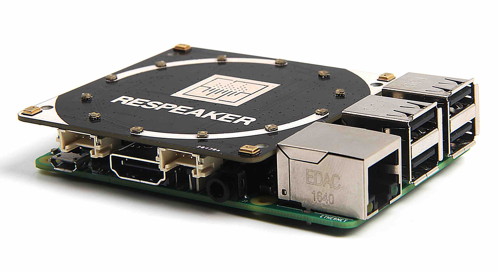

# ReSpeaker 4-Mic Array HAT



Peripheral controller for the [ReSpeaker 4-Mic Array](https://wiki.seeedstudio.com/ReSpeaker_4_Mic_Array_for_Raspberry_Pi/) by Seeed Studio, running alongside the Linux Voice Assistant (LVA) container.

The controller runs as a separate Docker container on the same Raspberry Pi. It connects to LVA's peripheral WebSocket API and drives the 12-LED APA102 ring with animations that mirror the [Home Assistant Voice PE](https://www.home-assistant.io/voice_control/voice_remote_local_assistant/) LED behaviour.

---

## Hardware

| Component | Details |
|---|---|
| Microphone array | 4 × MEMS mics at board corners (AC108 codec, I2S) |
| LED ring | 12 × APA102 RGB LEDs |
| Interface | Raspberry Pi 40-pin HAT connector |

### Compatible hardware

| Board | Notes |
|---|---|
| Raspberry Pi Zero 2 W | Recommended for compact builds |
| Raspberry Pi 3 B / B+ | Fully supported |
| Raspberry Pi 4 B | Fully supported |
| Raspberry Pi 5 | Requires seeed-voicecard driver compatible with kernel 6.6+ — see Step 1 |

---

## GPIO pin mapping

### LED ring (APA102)

| Signal | GPIO (BCM) | Notes |
|---|---|---|
| MOSI (data) | GPIO 10 | SPI0 MOSI |
| SCLK (clock) | GPIO 11 | SPI0 SCLK |
| CE (bus select) | GPIO 7 (CE1) | /dev/spidev0.1 |

---

## LED ring animations

All animations mirror the Home Assistant Voice PE ESPHome firmware exactly.

| LVA state | Animation | Description |
|---|---|---|
| No HA connection / not ready | Red twinkle | Random red sparkle across all LEDs |
| Idle | Off | All LEDs off |
| Wake word detected | Slow clockwise spin | Two trailing arcs at opposing positions |
| Listening | Fast clockwise spin | Same dual-arc pattern at 50 ms interval |
| Thinking | Pulsing pair | Two opposing LEDs fade in and out |
| TTS speaking | Anticlockwise spin | Dual-arc spin in reverse direction |
| Muted | Solid ring + red indicators | Full ring on; red at LEDs 1, 4, 7, 10 (mic corners) |
| Error | Red pulse | All LEDs red, pulsing |
| Timer ticking | Countdown arc | Arc proportional to `seconds_left / total_seconds` |
| Timer ringing | Pulse + optional red | Full ring pulsing; red at corners if muted |

"User color" comes from the Home Assistant Light entity described below (default: HAVPE-style blue). HA brightness scales every animation in this table. Semantic colors (Waiting/Listening cyan spin, Thinking pulse, Replying anticlockwise, Muted solid + red, Timer pulse/arc, Error red pulse) are hardcoded so they remain recognisable across user customisation.

### Mic indicator positions

The four mics sit at the corners of the square board. On the 12-LED ring (30° per step), the corners land at 45°, 135°, 225°, 315° → **LEDs 1, 4, 7, 10**.

---

## Home Assistant Light entity

On connect the controller registers a Light entity with LVA, which appears in Home Assistant as `light.leds`. It defaults off, matching the Voice PE LED Ring; turn it on for a solid idle glow and set its RGB color and brightness from the device page.

### Effects

| Effect | Behaviour |
|---|---|
| `Voice Assistant` (default) | Run the pipeline animations from the table above. Waiting/Listening animations are tinted with the HA color; brightness scales every animation. |

Like the Home Assistant Voice PE, this example exposes a single Voice Assistant effect: the pipeline animations always run and can't be switched off from HA. The peripheral protocol itself accepts any number of effects, so your own integration is free to declare more (a color loop, a static accent, and so on) — see the [peripheral API docs](../../docs/peripheral_api.md).

### Brightness, on/off, and color

Matching the HA Voice PE LED Ring, the Light defaults off, so the LEDs stay dark while idle until you turn it on; once on, idle shows the solid color, and turning it off again just removes that idle glow. The voice animations always run either way (on/off only gates the idle glow, it does not disable them), so the effect can't be switched off completely. Brightness scales linearly across every animation, and RGB color is the solid idle color and tints the Waiting/Listening animations.

---

## Installation

### Step 1 — Install the seeed-voicecard audio driver

> **This must be done on the host Raspberry Pi, not inside Docker.**

```bash
git clone https://github.com/respeaker/seeed-voicecard
cd seeed-voicecard
sudo ./install.sh
sudo reboot
```

After rebooting, verify the microphone appears:

```bash
arecord -l
# Expected: card X: seeed4micvoicec [seeed-4mic-voicecard]
```

> **Note:** The seeed-voicecard installer modifies `/boot/firmware/config.txt` automatically. Check the file after running `install.sh` — SPI may already be enabled.

> **Pi 5 note:** The standard seeed-voicecard repository may not support the Pi 5 kernel (6.6+). Check the [seeed-voicecard GitHub issues](https://github.com/respeaker/seeed-voicecard/issues) for a compatible branch or fork before proceeding.

### Step 2 — Enable SPI in config.txt

If the seeed-voicecard installer did not already enable SPI, add to `/boot/firmware/config.txt`:

```ini
dtparam=spi=on
```

Reboot and verify:

```bash
ls /dev/spidev*
# Should show: /dev/spidev0.0  /dev/spidev0.1
```

### Step 3 — Add user to GPIO and SPI groups

```bash
sudo usermod -aG gpio,spi $USER
```

Log out and back in. Check your UID:

```bash
id -u $USER
```

If it is not `1000`, update the `user:` field in `compose.yml` to match.

> **Pi 5 note:** On Pi 5, GPIO is exposed as `/dev/gpiochip4` not `/dev/gpiochip0`. Update the `devices` mapping in `compose.yml`:
> ```yaml
> devices:
>   - /dev/spidev0.1:/dev/spidev0.1
>   - /dev/gpiochip4:/dev/gpiochip4
> ```

### Step 4 — File structure

```
ReSpeaker 4mic HAT/
├── Dockerfile
├── compose.yml
├── requirements.txt
└── respeaker_4mic_hat.py
```

### Step 5 — Build and start

#### Option A — Run with Docker Compose (recommended)

```bash
docker compose up -d
```

Check logs:

```bash
docker compose logs -f
```
#### Option B — Run directly with Python

```bash
pip install -r requirements.txt
python respeaker_4mic_hat.py --host localhost --port 6055
```

---

## Configuration

All configuration is at the top of `respeaker_4mic_hat.py`:

```python
# LVA connection
DEFAULT_LVA_HOST = "localhost"
DEFAULT_LVA_PORT = 6055

# APA102 LED ring
LED_COUNT      = 12
SPI_BUS        = 0
SPI_DEVICE     = 1      # 1 = CE1 (/dev/spidev0.1), 0 = CE0 (/dev/spidev0.0)
LED_BRIGHTNESS = 10     # 0–31 (APA102 global brightness register)

# Default ring colour (R, G, B) — matches HA Voice PE default
DEFAULT_R, DEFAULT_G, DEFAULT_B = 24, 187, 242
```

### Command-line arguments

| Argument | Default | Description |
|---|---|---|
| `--host` | `localhost` | LVA container hostname or IP |
| `--port` | `6055` | LVA peripheral API port |
| `--debug` | off | Enable verbose debug logging |

---

## Drivers summary

| Component | Driver needed | Where to install | How |
|---|---|---|---|
| Microphone array (AC108) | **seeed-voicecard** | **Host Pi** | `git clone` + `sudo ./install.sh`, then reboot |
| LED ring (APA102) | SPI overlay | **Host Pi** | `dtparam=spi=on` in `config.txt`, then reboot |

---

## Troubleshooting

### Microphone not detected by LVA

1. Confirm `arecord -l` shows `seeed-4mic-voicecard` on the host.
2. If not, re-run `sudo ./install.sh` from the seeed-voicecard repository and reboot.
3. On Raspberry Pi 5 with kernel 6.6+, check the [seeed-voicecard GitHub issues](https://github.com/respeaker/seeed-voicecard/issues) for a compatible branch.

### LEDs do not light up

1. Confirm `dtparam=spi=on` is in `/boot/firmware/config.txt` and the Pi has been rebooted.
2. Check `/dev/spidev0.1` exists: `ls /dev/spidev*`. If only `spidev0.0` exists, change `SPI_DEVICE = 0` in the script and update the device mapping in `compose.yml` to `/dev/spidev0.0`.
3. Confirm the container user is in the `spi` group: `groups $USER`.
4. Run with `--debug` and look for `APA102 LED ring initialised` in the logs.

### SPI and seeed-voicecard conflict

The seeed-voicecard driver uses I2S — it does **not** use SPI — so there is no conflict with the APA102 LED ring. Both can run simultaneously without any special configuration.

### LVA not reachable

1. Confirm LVA is running and port 6055 is open: `nc -zv localhost 6055`.
2. With `network_mode: host`, `localhost` resolves to the Pi itself.
3. If LVA runs in a separate Docker network, use its container IP or service name as `--host`.