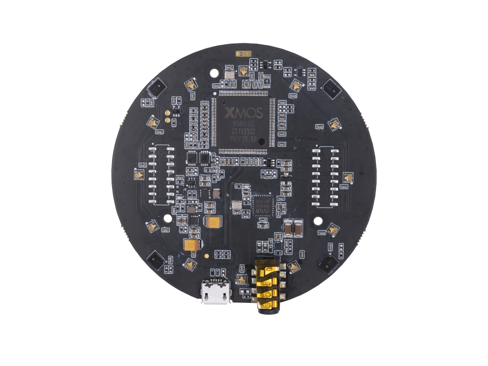

# ReSpeaker Mic Array v2.0 (USB)



Peripheral controller for the [ReSpeaker Mic Array v2.0](https://wiki.seeedstudio.com/ReSpeaker_Mic_Array_v2.0/) by Seeed Studio, running alongside the Linux Voice Assistant (LVA) container.

The controller runs as a separate Docker container and connects to LVA's peripheral WebSocket API. It drives the 12-LED APA102 ring via a USB HID vendor command to the device's onboard XMOS XVF3000 firmware.

> **This board connects over USB** — no GPIO, no SPI, no Raspberry Pi HAT required. It works on any Linux host including Raspberry Pi, desktop PCs, and mini-PCs.

---

## Hardware

| Component | Details |
|---|---|
| Microphone array | 4 × MEMS mics at DOA 0°, 90°, 180°, 270° (XMOS XVF3000) |
| LED ring | 12 × APA102 RGB LEDs |
| Connection | USB (Vendor `0x2886`, Product `0x0018`) |

---

## LED ring animations

All animations mirror the Home Assistant Voice PE ESPHome firmware exactly.

| LVA state | Animation | Description |
|---|---|---|
| No HA connection / not ready | Red twinkle | Random red sparkle across all LEDs |
| Idle | Solid user color (if light on) or off | All LEDs show user color and brightness when light is on, else dark |
| Wake word detected | Slow clockwise spin | Two trailing arcs at opposing positions |
| Listening | Fast clockwise spin | Same dual-arc pattern at 50 ms interval |
| Thinking | Pulsing pair | Two opposing LEDs fade in and out |
| TTS speaking | Anticlockwise spin | Dual-arc spin in reverse direction |
| Muted | Red mic indicators | LEDs 0, 3, 6, 9 red; neighbours blanked (4 mic cardinal positions) |
| Error | Red pulse | All LEDs red, pulsing |
| Timer ticking | Countdown arc | Arc proportional to `seconds_left / total_seconds` |
| Timer ringing | Pulse + optional red | Full ring pulsing; red at mic positions if muted |

"User color" comes from the Home Assistant Light entity described below (default: HAVPE-style blue). HA brightness scales every animation in this table. Semantic colors (Waiting/Listening cyan spin, Thinking pulse, Replying anticlockwise, Muted solid + red, Timer pulse/arc, Error red pulse) are hardcoded so they remain recognisable across user customisation.

### Mic indicator positions

The v2.0 has 4 microphones at DOA 0°, 90°, 180°, 270°. On the 12-LED ring (30° per step) this maps to **LEDs 0, 3, 6, 9** — the four cardinal points. When muted, these four LEDs turn red and their immediate neighbours are blanked so each indicator stands out as a distinct dot.

```
          LED 3  ← MIC (DOA 90°)
     2 ·       · 4
   1 ·           · 5
  0 ·             · 6
↑MIC               MIC↑
(DOA 0°)       (DOA 180°)
   11 ·         · 7
     10 ·     · 8
          LED 9  ← MIC (DOA 270°)

  Mic LEDs: 0, 3, 6, 9
```

---

## Home Assistant Light entity

On connect the controller registers a Light entity with LVA, which appears in Home Assistant as `light.leds`. It defaults off, matching the Voice PE LED Ring; turn it on for a solid idle glow and set its RGB color and brightness from the device page.

### Effects

| Effect | Behaviour |
|---|---|
| `Voice Assistant` (default) | Run the pipeline animations from the table above. Waiting/Listening animations are tinted with the HA color; brightness scales every animation. |

Like the Home Assistant Voice PE, this example exposes a single Voice Assistant effect: the pipeline animations always run and can't be switched off from HA. The peripheral protocol itself accepts any number of effects, so your own integration is free to declare more (a color loop, a static accent, and so on) — see the [peripheral API docs](../../docs/peripheral_api.md).

### Brightness, on/off, and color

Matching the HA Voice PE LED Ring, the Light defaults off, so the LEDs stay dark while idle until you turn it on; once on, idle shows the solid color, and turning it off again just removes that idle glow. The voice animations always run either way (on/off only gates the idle glow, it does not disable them), so the effect can't be switched off completely. Brightness scales linearly across every animation, and RGB color is the solid idle color and tints the Waiting/Listening animations.

---

## Installation

### Step 1 — Install udev rule (required for non-root USB access)

Run once on the **host**:

```bash
sudo tee /etc/udev/rules.d/99-respeaker.rules << 'EOF'
SUBSYSTEM=="usb", ATTR{idVendor}=="2886", ATTR{idProduct}=="0018", \
    MODE="0666", GROUP="plugdev", SYMLINK+="respeaker"
EOF
sudo udevadm control --reload-rules
sudo udevadm trigger
```

This creates a stable symlink at `/dev/respeaker` and makes the device accessible to the `plugdev` group. After this you can tighten Docker's device access — see the note in `docker-compose.yml`.

Verify the device is visible:

```bash
lsusb | grep 2886:0018
# Example: Bus 001 Device 005: ID 2886:0018 SEEED Technology...
```

### Step 2 — Verify microphone

The device enumerates as a standard USB audio device — no driver install needed:

```bash
arecord -l
# Should list: SEEED ReSpeaker Mic Array v2.0
```

Pass the device to LVA:

```bash
--audio-input-device "SEEED ReSpeaker Mic Array v2.0"
```

Or in LVA's compose environment:

```yaml
environment:
  - AUDIO_INPUT_DEVICE=SEEED ReSpeaker Mic Array v2.0
```

### Step 3 — File structure

```
ReSpeaker Mic Array v2.0 (USB)/
├── Dockerfile
├── docker-compose.yml
├── requirements.txt
└── respeaker_usb_mic_array.py
```

### Step 4 — Build and start

#### Option A — Run with Docker Compose (recommended)

```bash
cd respeaker_usb
docker compose up -d
```

Check logs:

```bash
docker compose logs -f
```

#### Option B — Run directly with Python

```bash
pip install -r requirements.txt
python respeaker_usb_mic_array.py --host localhost --port 6055
```

---

## Configuration

All configuration is at the top of `respeaker_usb_mic_array.py`:

```python
# LVA connection
DEFAULT_LVA_HOST = "localhost"
DEFAULT_LVA_PORT = 6055

# USB device
USB_VENDOR_ID  = 0x2886
USB_PRODUCT_ID = 0x0018

# LED ring
LED_COUNT      = 12
LED_BRIGHTNESS = 10     # 0–31 (APA102 5-bit global brightness register)
```

### Command-line arguments

| Argument | Default | Description |
|---|---|---|
| `--host` | `localhost` | LVA container hostname or IP |
| `--port` | `6055` | LVA peripheral API port |
| `--debug` | off | Enable verbose debug logging |

---

## Drivers summary

| Component | Driver needed | How |
|---|---|---|
| Microphone array (XMOS XVF3000) | **None** | Enumerates as USB audio automatically |
| LED ring (APA102 via USB HID) | udev rule | `99-respeaker.rules` on host |

---

## Troubleshooting

### Microphone not detected by LVA

1. Confirm `arecord -l` lists the device on the host.
2. Check the USB cable — the device uses micro-USB and requires a data cable, not a charge-only cable.
3. Try a different USB port. The v2.0 draws up to 900 mA; use a powered USB hub or a USB 3.0 port on Pi 4/5.

### LEDs do not light up

1. Confirm the device appears in `lsusb | grep 2886:0018`.
2. Check the udev rule is applied: `ls -la /dev/respeaker` should show the symlink.
3. Run with `--debug` and look for `ReSpeaker Mic Array v2.0 found` in the logs. If you see `not found`, check the USB connection and udev rule.
4. If you see a USB permission error, confirm `privileged: true` is set in `docker-compose.yml`, or that the udev rule is active and the container's user is in the `plugdev` group.

### USB error after reconnect

The script automatically attempts to re-find the device after a USB error (e.g. cable unplug/replug). Watch the logs for `Attempting to reconnect to ReSpeaker USB device`. If the device does not re-enumerate within a few seconds, restart the container.

### LVA not reachable

1. Confirm LVA is running and port 6055 is open: `nc -zv localhost 6055`.
2. With `network_mode: host`, `localhost` resolves to the host itself regardless of where the LVA container runs.
3. If LVA is on a different machine, use its IP address as `--host`.