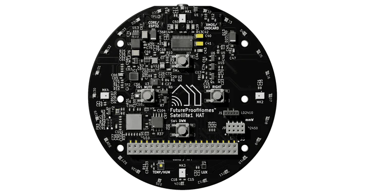

# Satellite 1 HAT Board 



Peripheral controller for the [Satellite1 HAT Board](https://futureproofhomes.net/products/satellite1-top-microphone-board) by FutureProofHomes, running alongside the Linux Voice Assistant (LVA) container.

The controller runs as a separate Docker container on the same Raspberry Pi. It connects to LVA's peripheral WebSocket API, drives the 12-LED SK6812 ring with animations that mirror the [Home Assistant Voice PE](https://www.home-assistant.io/voice-pe/) LED behaviour, and maps the four hardware buttons to LVA commands with multipress support on the context action button.

---

## Hardware

| Component | Details |
|---|---|
| Microphone array | XMOS XVF3800 (USB, far-field, onboard DSP) |
| LED ring | 12 × SK6812 RGBW NeoPixels |
| Buttons | 4 × tactile (top, bottom, left, right) |
| Audio output | I2S line-out (optional) |
| Interface | Raspberry Pi 40-pin HAT connector |

### Compatible hardware

The Satellite 1 HAT works on any Raspberry Pi with a 40-pin GPIO header. Tested targets:

- Raspberry Pi Zero 2 W
- Raspberry Pi 3 B / B+
- Raspberry Pi 4 B
- Raspberry Pi 5

---

## GPIO pin mapping

| Function | GPIO (BCM) | Notes |
|---|---|---|
| LED ring data | 12 | PWM0, channel 0 |
| Right button (Volume Up) | 17 | Active low, internal pull-up |
| Left button (Volume Down) | 27 | Active low, internal pull-up |
| Top button (Mute / Unmute) | 22 | Active low, internal pull-up |
| Bottom button (Context action) | 23 | Active low, internal pull-up | — **supports multipress** |

---

## Home Assistant Light Entity

The Satellite1 peripheral controller automatically registers an LED light entity with Home Assistant via LVA. This allows you to control the LED ring color and brightness directly from HA.

### Light entity details

| Property | Value |
|---|---|
| Entity ID | `light.<satellite>_leds` |
| Supported features | On/Off, RGB color, brightness, effect |
| Default effect | "Voice Assistant" |
| RGB default | Cyan (9.4% R, 73.3% G, 94.9% B) |
| Brightness default | 66% |
| On/Off default | **Off** (idle stays dark until activated) |

### Controlling from Home Assistant

In Home Assistant, you can:

1. **Turn the light on/off** — toggles the idle LED glow. When off, only active pipeline animations show (listening, thinking, speaking, etc.). When on, the ring displays your chosen color during idle/standby.

2. **Set color** — pick any RGB color. All pipeline animations are tinted by your chosen color (matching Home Assistant Voice PE behavior):
   - Wake word → Flash in your color
   - Listening → Chase in your color
   - Thinking → Pulse in your color
   - Speaking → Reverse spin in your color
   - Muted → Solid ring in your color + red at mic positions
   - Timer → Countdown arc in your color

3. **Set brightness** — scales all animations by the chosen brightness (0–100%). Useful for adapting to ambient lighting.

4. **Use automations** — e.g., dim the LEDs at night, change color based on assistant state, or flash for alerts.

### Service calls example (YAML)

```yaml
# Turn on and set to purple
service: light.turn_on
target:
  entity_id: light.satellite1_leds
data:
  rgb_color: [200, 0, 255]
  brightness: 200

# Dim for night mode
service: light.turn_on
target:
  entity_id: light.satellite1_leds
data:
  brightness: 80

# Turn off (hides idle glow, shows only pipeline animations)
service: light.turn_off
target:
  entity_id: light.satellite1_leds
```

---

## Button behaviour

### Right button — Volume Up
Sends `volume_up` to LVA. Each press increases volume by one step.

### Left button — Volume Down
Sends `volume_down` to LVA. Each press decreases volume by one step.

### Top button — Mute / Unmute
Toggles microphone mute. Sends `mute_mic` when unmuted, `unmute_mic` when muted. The LED ring switches to the muted indicator pattern immediately.

### Bottom button — Context action (with multipress and color change support)

This button supports single-press context actions, multi-press gestures, **and color changing via the HSV hue wheel** (matching Home Assistant Voice PE):

#### Single press (< 100 ms hold time)

Context-aware command based on current assistant state, mirroring the Home Assistant Voice PE centre button priority:

| Current state | Command sent |
|---|---|
| Timer ringing | `stop_timer_ringing` |
| Wake word / listening / thinking / TTS speaking | `stop_pipeline` |
| Music / media playing | `stop_media_player` |
| Any other (idle) | `start_listening` |

#### Multi-press gestures

When the action button is released quickly (not held), it detects multiple presses:

| Gesture | Timing | Command sent | Use case |
|---|---|---|---|
| **Double press** | 2 presses < 250 ms apart | `button_double_press` | Trigger custom HA automations, mode toggles, etc. |
| **Triple press** | 3 presses < 250 ms apart | `button_triple_press` | Access menu, configuration, advanced features |
| **Long press** | Single press held > 1000 ms | `button_long_press` | Scene activation, do-not-disturb, night mode, etc. |

**Examples:**
- Double press → start a specific routine or mode
- Triple press → access a menu or configuration option
- Long press → toggle do-not-disturb or night mode

These commands are exposed as button press events to Home Assistant (via the registered button sensor), allowing you to create custom automations via `button_press_event` triggers.

**Note:** The color change mode (hold + volume) activates after ~100 ms of holding, allowing quick single presses to still trigger context actions.

#### Hold + Volume buttons — Color wheel rotation

Hold down the action button and use the volume buttons to rotate through the HSV color wheel (matching Voice PE's rotary dial):

| Action | Effect |
|---|---|
| **Hold + Volume Up** | Rotate hue +10° (clockwise around color wheel) |
| **Hold + Volume Down** | Rotate hue -10° (counter-clockwise around color wheel) |

The color wheel provides **36 distinct color stops** (0°–360° in 10° increments):
- **0°** – Red
- **60°** – Yellow
- **120°** – Green
- **180°** – Cyan
- **240°** – Blue
- **300°** – Magenta

Each press changes the hue by 10°, allowing smooth navigation around the full color spectrum. The LED ring updates immediately to show the new color during idle/standby (when the light is on).

**Example workflow:**
1. Press and hold the action button
2. Press volume up repeatedly to cycle through warm colors (red → orange → yellow)
3. Release action button to confirm and exit color mode
4. The new color persists in Home Assistant

---

## LED ring animations

All animations mirror the Home Assistant Voice PE ESPHome firmware exactly. The ring color is driven by the HA Light entity (see [Home Assistant Light Entity](#home-assistant-light-entity) above).

| LVA state | Animation | Description |
|---|---|---|
| No HA connection / error | Red twinkle | Random red sparkle across all LEDs |
| Idle | User color (when light on) | Ring shows your HA light color at configured brightness, or off if light is disabled |
| Wake word detected | Slow clockwise spin | Two trailing arcs at opposing positions, tinted by your color |
| Listening | Fast clockwise spin | Same dual-arc pattern at 50 ms interval, tinted by your color |
| Thinking | Pulsing pair | Two opposing LEDs fade in and out, tinted by your color |
| TTS speaking | Anticlockwise spin | Dual-arc spin in reverse direction, tinted by your color |
| Muted | Solid ring + red indicators | Full ring tinted by your color; red at positions 0, 3, 6 & 9 (all 4 mic locations) |
| Error | Red pulse | All LEDs red, pulsing |
| Timer ticking | Countdown arc | Arc length proportional to `seconds_left / total_seconds`, tinted by your color |
| Timer ringing | Pulse + optional red | Full ring pulsing in your color; red at 3 & 9 if muted |

**Note:** All animations except twinkle, off, and error animations use the color from the HA Light entity. This means you can customize the entire LED experience from Home Assistant by adjusting the light's RGB color and brightness.

---

## Installation

### Step 1 — Host kernel configuration

> **This must be done on the host Raspberry Pi, not inside Docker.**

Edit `/boot/firmware/config.txt` (or `/boot/config.txt` on older Raspberry Pi OS):

```ini
# Enable PWM on GPIO 12 for the SK6812 LED ring
dtoverlay=pwm,pin=12,func=4

# Disable onboard audio — it shares PWM0 with GPIO 12
# dtparam=audio=on    ← comment this out

# Optional: I2S line-out if using the HAT's audio output
# dtoverlay=hifiberry-dac

# Optional: increase GPU memory on Pi Zero 2 W
# gpu_mem=64
```

Reboot after saving:

```bash
sudo reboot
```

> **Why disable onboard audio?** The Raspberry Pi's 3.5 mm headphone jack uses the same PWM0 hardware peripheral as GPIO 12. They cannot run simultaneously. The Satellite 1 HAT's XMOS microphone array connects over USB and is unaffected.

> **Pi 5 note:** On the Raspberry Pi 5, GPIO is exposed as `/dev/gpiochip4` instead of `/dev/gpiochip0`. Update the `devices` mapping in `compose.yml`:
> ```yaml
> devices:
>   - /dev/gpiochip4:/dev/gpiochip4
>   - /dev/mem:/dev/mem
>   - /dev/vcio:/dev/vcio
> ```

### Step 2 — Add user to GPIO group

```bash
sudo usermod -aG gpio,spi $USER
```

Log out and back in for the group change to take effect.

### Step 3 — File structure

Place all files in the same directory:

```
Satellite1 HAT Board/
├── Dockerfile
├── compose.yml
├── requirements.txt
└── Satellite1_HAT_Board.py
```

### Step 4 — Build and start

#### Option A — Run with Docker Compose (recommended)

```bash
docker compose up -d
```

Check logs:

```bash
docker compose logs -f
```


#### Option B — Run directly with Python
```bash
pip install -r requirements.txt
python Satellite1_HAT_Board.py --host localhost --port 6055
```


---

## Configuration

All configuration is at the top of `Satellite1_HAT_Board.py`:

```python
# LVA connection
DEFAULT_LVA_HOST = "localhost"
DEFAULT_LVA_PORT = 6055

# GPIO pins (BCM numbering)
LED_GPIO_PIN    = 12
BTN_VOLUME_UP   = 17
BTN_VOLUME_DOWN = 27
BTN_MUTE        = 22
BTN_ACTION      = 23

BTN_DEBOUNCE_MS = 150   # Button debounce in milliseconds

# Button multipress timing
MULTIPRESS_TIMEOUT_MS = 500    # Time window between presses (ms)
LONG_PRESS_MS         = 1000   # Duration to detect long press (ms)


# LED ring
LED_COUNT      = 12
LED_BRIGHTNESS = 168    # 0–255, default is 66 % (168)

# HA Light entity registration
LIGHT_OBJECT_ID = "leds"
LIGHT_NAME      = "LEDs"
EFFECT_VOICE_ASSISTANT = "Voice Assistant"

# Default ring colour — matches HA Voice PE default (cyan)
# These are used before the first light_command from HA arrives
DEFAULT_R, DEFAULT_G, DEFAULT_B = 24, 187, 242
```

### Light entity configuration

The light entity is automatically registered with LVA on startup and will appear in Home Assistant as `light.<satellite>_leds`. You can customize it in HA's UI:

- **Entity name** — rename to your preference in HA  
- **Color** — adjust in HA's light picker (RGB mode)
- **Brightness** — scale all animations
- **Toggle on/off** — show/hide idle glow
- **Automations** — react to time of day, other entities, etc.

For details, see [Home Assistant Light Entity](#home-assistant-light-entity) above.

### Command-line arguments

The container command in `compose.yml` accepts:

| Argument | Default | Description |
|---|---|---|
| `--host` | `localhost` | LVA container hostname or IP |
| `--port` | `6055` | LVA peripheral API port |
| `--debug` | off | Enable verbose debug logging |

To connect to LVA running on a different host:

```yaml
command:
  - "--host"
  - "192.168.1.50" # Use your actual device ip address
  - "--port"
  - "6055"
```

---

## Connection to LVA

The controller connects to LVA's peripheral WebSocket API at `ws://<host>:6055`. The LVA container must have the peripheral API enabled (it is on by default) and port 6055 must be reachable.

On startup the controller:
1. Connects to LVA and registers a Light entity for the LED ring with Home Assistant
2. Receives a state snapshot (current mute state, volume, HA connection status, and light state)
3. Sets the LED ring to the appropriate animation immediately
4. Begins listening for events from LVA and button presses from the hardware

If the connection is lost (LVA restarted, network drop), the controller shows a red twinkle animation and automatically reconnects every 3 seconds.

---

## Using multipress events in Home Assistant

The multipress commands (`button_double_press`, `button_triple_press`, `button_long_press`) are sent to LVA's peripheral API and exposed as button press events. You can trigger Home Assistant automations based on these events.

### Example Home Assistant automation

Create an automation file or use the automation UI:

```yaml
automation:
  - alias: "Double press context button for Movie Time"
    trigger:
      platform: event
      event_type: button_press_event
      event_data:
        press_type: double_press
    action:
      - service: scene.turn_on
        target:
          entity_id: scene.movie_time

  - alias: "Long press context button for Do Not Disturb"
    trigger:
      platform: event
      event_type: button_press_event
      event_data:
        press_type: long_press
    action:
      - service: input_boolean.turn_on
        target:
          entity_id: input_boolean.do_not_disturb
```

---

## Drivers summary

| Component | Driver needed | Where to install | How |
|---|---|---|---|
| LED ring (SK6812) | PWM kernel overlay | **Host Pi** | `dtoverlay=pwm,pin=12,func=4` in `config.txt`, then reboot |
| Buttons | None | — | `gpiozero` + `lgpio` installed inside container via pip |
| Microphone (XMOS XVF3800) | None | — | Enumerates as USB audio device automatically |
| I2S line-out (optional) | HiFiBerry DAC overlay | **Host Pi** | `dtoverlay=hifiberry-dac` in `config.txt`, then reboot |

---

## Troubleshooting

### LEDs do not light up

1. Confirm `dtoverlay=pwm,pin=12,func=4` is in `config.txt` and the Pi has been rebooted.
2. Confirm onboard audio is disabled (`dtparam=audio=on` is commented out).
3. Check the container is running as root (`user: "0:0"` in compose file) — `rpi-ws281x` requires root for DMA access via `/dev/mem`.
4. Run with `--debug` and look for `LED ring initialised` in the logs. If `rpi_ws281x not found` appears, the Python package failed to install — rebuild the image.
5. **If you see only pipeline animations (listening, thinking, etc.) but no idle glow:** The light entity defaults to **off** in Home Assistant to match Voice PE behavior. Turn on the `light.<satellite>_leds` entity in HA to show the idle LED color.

### Buttons do not respond

1. Confirm `/dev/gpiochip0` (or `/dev/gpiochip4` on Pi 5) is mapped in the compose `devices` section.
2. Run with `--debug` — each button press logs `Button → <command>`.

### Light entity not appearing in Home Assistant

1. Confirm the Satellite1 container is connected to LVA: check `docker compose logs` for `Connected to LVA peripheral API`.
2. Confirm LVA is connected to Home Assistant: the LVA logs should show `Home Assistant connected` and the satellite integration should be visible in HA's integrations.
3. Restart Home Assistant or refresh the Devices page — the new light entity should appear under the satellite integration.
4. Entity ID will be `light.<satellite>_leds` where `<satellite>` is your satellite name in HA (e.g., `light.kitchen_satellite_leds`).

### Container exits immediately

1. Run `docker compose logs` — a missing `/dev/mem` or `/dev/vcio` device produces a clear error at startup.
2. Ensure `privileged: true` is set in the compose file.

### LVA not reachable

1. Confirm LVA is running and `--disable-peripheral-api` was not passed.
2. With `network_mode: host`, `localhost` resolves to the Pi itself. If LVA is in a separate Docker network (not host mode), use its container IP or service name instead.
3. Check that port 6055 is not blocked: `nc -zv localhost 6055`.
